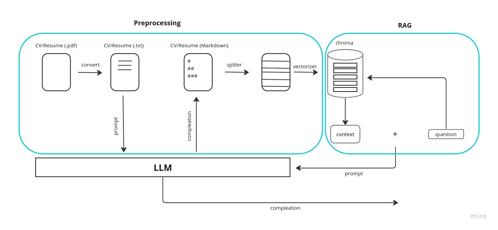

# Chat with your Candidate
An interactive chatbot designed to engage with job candidates using their resumes, driven by the capabilities of Language Models (LLMs), Langchain integration, and Gradio interface.

## Demo

<iframe width="560" height="315" src="https://www.youtube.com/embed/SBC4bH_6u4I?si=szvJ4IpU_eXh6W1q" title="YouTube video player" frameborder="0" allow="accelerometer; autoplay; clipboard-write; encrypted-media; gyroscope; picture-in-picture; web-share" allowfullscreen></iframe>


### Running APP
```command
make build
make run
```
### Functionality Overview

The system operates through three distinct methods of interaction:

1. **Local Invocation:**
   By default, the system downloads a quantized `.bin` version of the **llama2 7b chat** model from Hugging Face. It then utilizes the llama cpp langchain APIs to load the model locally for processing.

2. **Hugging Face API:**
   The system interfaces with the Hugging Face API endpoint, enabling the use of various text-to-text language models (LLMs) like **llama2** or **T5**. These models are accessible remotely through the Hugging Face platform.

3. **OpenAI API:**
   The system also supports communication with the OpenAI API endpoint, allowing access to models hosted by OpenAI.

### Processing Workflow for Uploaded CV

Upon uploading a Curriculum Vitae (CV), the system employs a sequence of langchain APIs to process the document effectively:

1. **Conversion and Reformatting:**
   The CV is initially transformed from a PDF format into a markdown format. This conversion facilitates the subsequent division of the CV into meaningful sections, a crucial step for retrieval purposes. During this stage, the LLM model is invoked to aid in reformatting.

2. **Chunk Embedding:**
   The reformatted sections of the CV, referred to as "chunks," are converted into text embeddings. This conversion is carried out using a text embedding model available through Hugging Face. The resulting embeddings serve as representations for the chunks during the retrieval process.

3. **Context Retrieval:**
   The system identifies the most relevant and promising chunks based on their similarity to a given question. These selected chunks are then compressed and combined to form a coherent context. This compression step involves utilizing the LLM model to generate a cohesive representation of the relevant information.

4. **Question-Context Interaction:**
   The generated question and compressed context are subsequently input into the LLM model. This interaction results in the generation of a response that addresses the initial question. The LLM leverages the combined information to craft a relevant and accurate response.

By following this comprehensive processing workflow, the system effectively leverages LLMs, text embeddings, and advanced language processing techniques to handle CVs and provide insightful responses to user queries.

### Daigram


